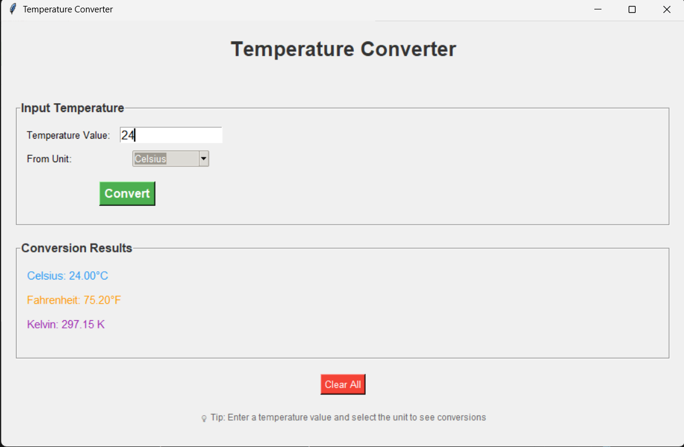
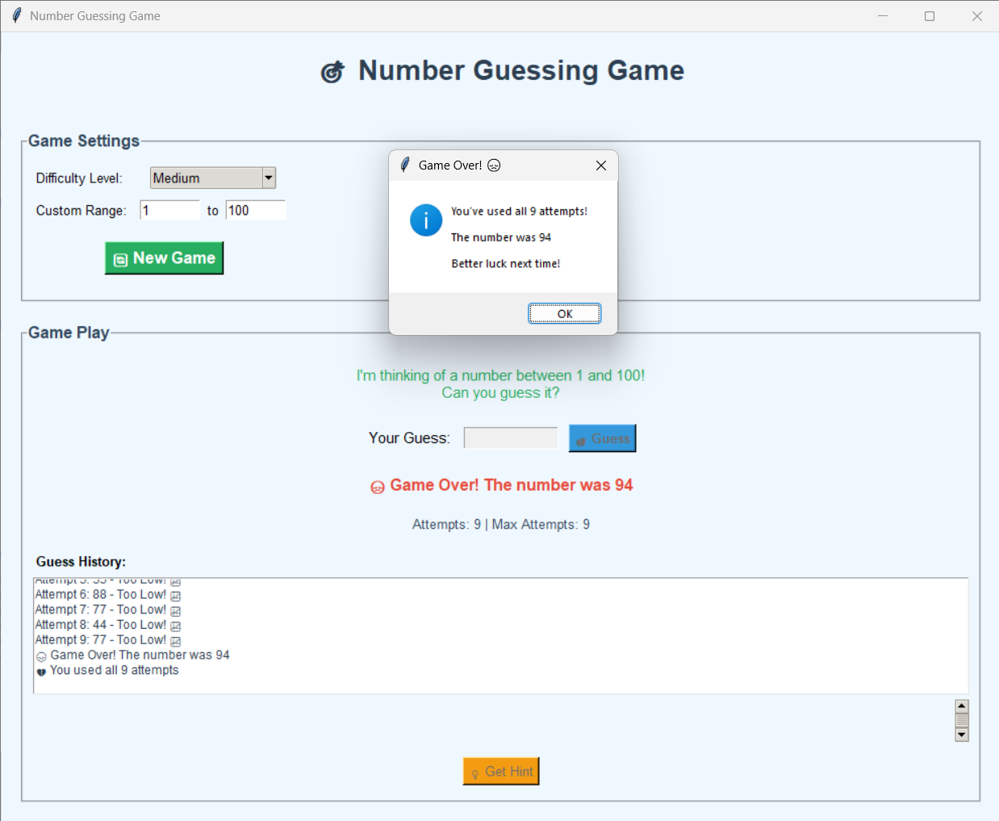
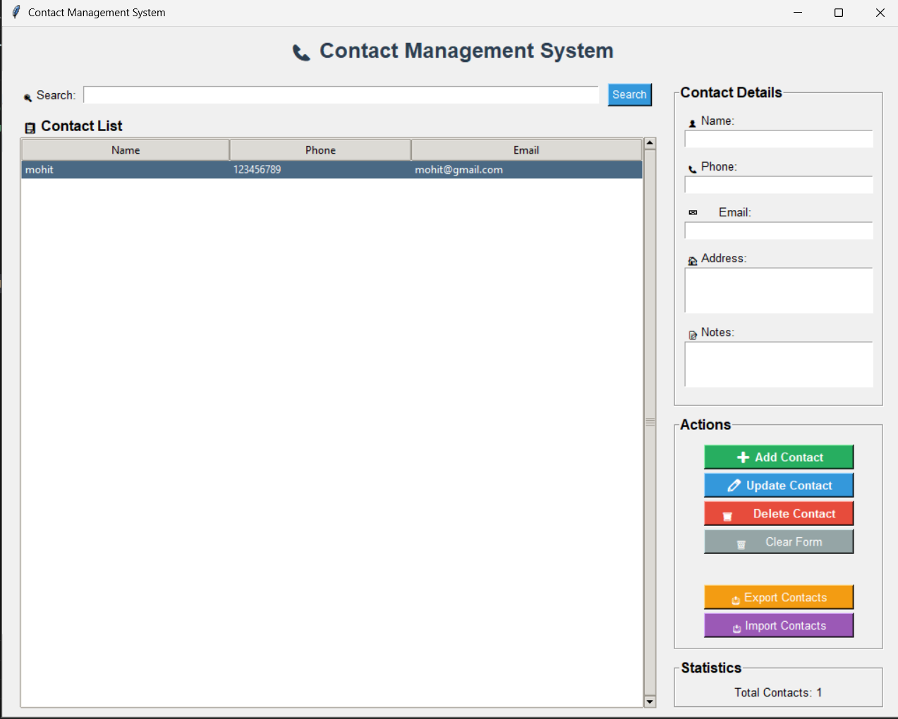
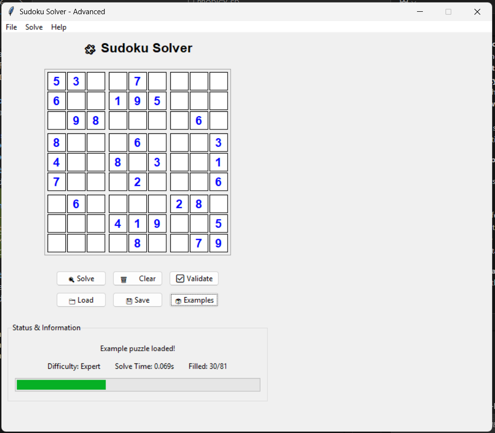
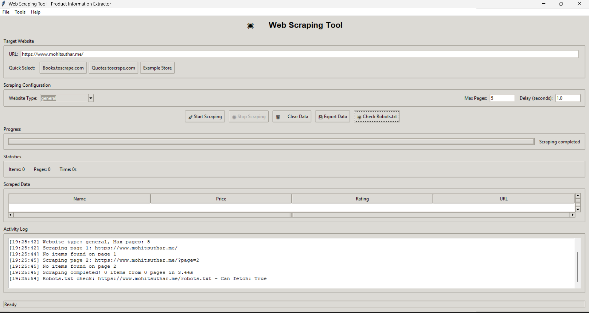

# PRODIGY Software Development Internship

This repository contains all the programming tasks and projects completed during the PRODIGY Software Dev## 📸 Application Screenshots

### Complete Application Suite
All five tasks are now showcased with screenshots, demonstrating the full range of software development skills from basic programming to advanced algorithms and professional GUI design.

This internship program. Each task demonstrates different aspects of software development, from basic programming concepts to advanced algorithms and user interface design.

## 📋 Completed Tasks Overview

### ✅ Task 1: Temperature Converter
**Status:** Completed ✅  
**Folder:** `Task_01_Temperature_Converter/`  
**Description:** A comprehensive temperature conversion application that converts between Celsius, Fahrenheit, and Kelvin scales with both GUI and CLI interfaces.

**Screenshot:**

*Temperature Converter in action - Converting 24°C to Fahrenheit and Kelvin*

**Key Features:**
- Real-time temperature conversion between C, F, and K scales
- User-friendly GUI with modern interface design
- Command-line version for terminal users
- Comprehensive input validation and error handling
- Scientific accuracy with proper rounding
- Cross-platform compatibility

**Technologies Used:** Python, tkinter, Mathematical Calculations, Input Validation

### ✅ Task 2: Number Guessing Game
**Status:** Completed ✅  
**Folder:** `Task_02_Guessing_Game/`  
**Description:** An interactive number guessing game that challenges users to guess a randomly generated number with multiple difficulty levels and smart feedback.

**Screenshot:**

*Number Guessing Game showing completed game with attempt history and game over dialog*

**Key Features:**
- Multiple difficulty levels (Easy, Medium, Hard, Expert, Custom)
- Smart attempt limiting based on optimal algorithms
- Hint system and performance rating
- Game statistics and guess history tracking
- Visual feedback with color-coded responses
- Both GUI and CLI versions

**Technologies Used:** Python, tkinter, Random Generation, Game Logic, Statistical Analysis

### ✅ Task 3: Contact Management System
**Status:** Completed ✅  
**Folder:** `Task_03_Contact_Management/`  
**Description:** A full-featured contact management system with persistent storage, data validation, and import/export capabilities.

**Screenshot:**

*Contact Management System showing contact list, detailed form fields, and complete CRUD operations with import/export functionality*

**Key Features:**
- Complete CRUD operations (Create, Read, Update, Delete)
- Advanced search and filtering capabilities
- Data validation for phone numbers and email addresses
- JSON-based persistent storage
- Import/export functionality for backup and restore
- Duplicate detection and prevention
- Contact statistics and analytics

**Technologies Used:** Python, tkinter, JSON, Data Validation, File Operations

### ✅ Task 4: Sudoku Solver
**Status:** Completed ✅  
**Folder:** `Task_04_Sudoku_Solver/`  
**Description:** A comprehensive Sudoku solving application with advanced backtracking algorithms, puzzle validation, and interactive solving capabilities.

**Screenshot:**

*Advanced Sudoku Solver with interactive grid, example puzzles, validation features, and lightning-fast solving algorithm (0.069s solve time)*

**Key Features:**
- Advanced backtracking algorithm for automatic solving
- Puzzle validation and conflict detection
- Animated solving with step-by-step visualization
- Multiple input methods (manual, file import, examples)
- Difficulty assessment and performance metrics
- Import/export functionality for various formats
- Interactive interface with visual feedback
- Complete statistics and analysis

**Technologies Used:** Python, tkinter, Backtracking Algorithms, Recursive Problem Solving

### ✅ Task 5: Web Scraping Tool
**Status:** Completed ✅  
**Folder:** `Task_05_Web_Scraping/`  
**Description:** A professional web scraping tool for extracting product information from e-commerce websites with ethical scraping practices and multiple export formats.

**Screenshot:**

*Professional web scraping interface showing completed scraping session with robots.txt compliance checking, real-time progress tracking, and comprehensive data extraction capabilities*

**Key Features:**
- Multi-website support (Books, Quotes, General E-commerce)
- Dual interface (GUI and CLI) for different user preferences
- Ethical scraping with robots.txt compliance checking
- Multiple export formats (CSV, JSON, Excel)
- Real-time progress tracking and status updates
- Session management for optimal performance
- Comprehensive error handling and recovery
- Data validation and sanitization

**Technologies Used:** Python, tkinter, Web Scraping, BeautifulSoup, Requests, Pandas, Data Analysis

## 🎯 Internship Learning Objectives

This internship program covers essential software development skills:

- **Programming Fundamentals**: Variables, functions, loops, conditionals
- **Object-Oriented Programming**: Classes, inheritance, encapsulation
- **User Interface Design**: GUI development with tkinter
- **Data Structures**: Lists, dictionaries, file handling
- **Algorithm Design**: Problem-solving and optimization
- **Software Architecture**: Modular design and code organization
- **Testing & Debugging**: Comprehensive testing strategies
- **Documentation**: Clear and professional documentation practices

## 📁 Project Structure

```
PRODIGY_SD/
├── Task_01_Temperature_Converter/    # Temperature Conversion Program
│   ├── temperature_converter.py      # GUI version (tkinter-based)
│   ├── temperature_converter_cli.py  # Command-line version
│   ├── test_demo.py                  # Test suite and demo launcher
│   ├── run_converter.bat             # Windows batch launcher
│   ├── requirements.txt              # Project dependencies
│   └── README.md                     # Task 1 documentation
├── Task_02_Guessing_Game/            # Number Guessing Game
│   ├── guessing_game.py              # GUI version (tkinter-based)
│   ├── guessing_game_cli.py          # Command-line version
│   ├── test_demo.py                  # Test suite and demo launcher
│   ├── run_game.bat                  # Windows batch launcher
│   ├── requirements.txt              # Project dependencies
│   └── README.md                     # Task 2 documentation
├── Task_03_Contact_Management/        # Contact Management System
│   ├── contact_manager.py            # GUI version (tkinter-based)
│   ├── contact_manager_cli.py        # Command-line version
│   ├── test_demo.py                  # Test suite and demo launcher
│   ├── run_contacts.bat              # Windows batch launcher
│   ├── requirements.txt              # Project dependencies
│   └── README.md                     # Task 3 documentation
├── Task_04_Sudoku_Solver/            # Sudoku Solver
│   ├── sudoku_solver.py              # GUI version (tkinter-based)
│   ├── sudoku_solver_cli.py          # Command-line version
│   ├── test_demo.py                  # Test suite and demo launcher
│   ├── run_sudoku.bat                # Windows batch launcher
│   ├── requirements.txt              # Project dependencies
│   └── README.md                     # Task 4 documentation
├── Task_05_Web_Scraping/             # Web Scraping Tool
│   ├── web_scraper.py                # GUI version (tkinter-based)
│   ├── web_scraper_cli.py            # Command-line version
│   ├── test_demo.py                  # Test suite and demo launcher
│   ├── run_scraper.bat               # Windows batch launcher
│   ├── requirements.txt              # Project dependencies
│   └── README.md                     # Task 5 documentation
├── launch_tasks.bat                  # Main launcher for all tasks
└── README.md                         # This main documentation
```


## �🚀 Quick Start Guide

### Prerequisites
- Python 3.7 or higher
- pip package manager
- Windows OS (for batch launchers)

### Running All Tasks
1. **Main Launcher**: Double-click `launch_tasks.bat` or run it from command prompt
2. **Individual Tasks**: Navigate to specific task folders and run their launchers

### Command Line Usage
```bash
# Clone or download the repository
cd PRODIGY_SD

# Run main launcher
launch_tasks.bat

# Or run individual tasks
cd Task_01_Temperature_Converter
run_converter.bat
```

## 🛠️ Installation & Setup

### Option 1: Using Main Launcher
```bash
# The main launcher will automatically handle dependencies
launch_tasks.bat
```

### Option 2: Manual Installation
```bash
# Install dependencies for each task
cd Task_01_Temperature_Converter
pip install -r requirements.txt

cd ../Task_02_Guessing_Game
pip install -r requirements.txt

# Repeat for other tasks...
```

### Option 3: Global Installation
```bash
# Install common dependencies globally
pip install tkinter matplotlib pandas requests beautifulsoup4 openpyxl
```

## 🔧 Technical Details

### Programming Language
- **Python 3.7+**: Modern Python with type hints and advanced features

### GUI Framework
- **tkinter**: Built-in Python GUI library for cross-platform applications

### Data Storage
- **JSON**: Human-readable data format for configuration and storage
- **CSV/Excel**: Data export and import capabilities

### External Libraries
- **requests**: HTTP library for web scraping
- **beautifulsoup4**: HTML/XML parsing for web scraping
- **pandas**: Data manipulation and analysis
- **openpyxl**: Excel file operations

### Development Practices
- **Modular Design**: Each task is self-contained with clear interfaces
- **Error Handling**: Comprehensive exception handling and user feedback
- **Testing**: Automated test suites for quality assurance
- **Documentation**: Inline code comments and README files
- **Version Control**: Git integration for code management

## 📊 Task Complexity & Skills Demonstrated

| Task | Complexity | Core Skills | Advanced Features |
|------|------------|-------------|-------------------|
| **Task 1** | ⭐⭐ | Basic I/O, Math Functions | Real-time conversion, Validation |
| **Task 2** | ⭐⭐⭐ | Random Numbers, Loops | Difficulty levels, Statistics |
| **Task 3** | ⭐⭐⭐⭐ | Data Structures, File I/O | Search, Validation, Export |
| **Task 4** | ⭐⭐⭐⭐⭐ | Algorithms, Recursion | Backtracking, Animation |
| **Task 5** | ⭐⭐⭐⭐⭐ | Web APIs, Data Processing | Ethical scraping, Multi-format export |

## 🎮 How to Use Each Task

### Task 1: Temperature Converter
```bash
cd Task_01_Temperature_Converter
py temperature_converter.py      # GUI version
py temperature_converter_cli.py  # CLI version
```

### Task 2: Number Guessing Game
```bash
cd Task_02_Guessing_Game
py guessing_game.py      # GUI version
py guessing_game_cli.py  # CLI version
```

### Task 3: Contact Management
```bash
cd Task_03_Contact_Management
py contact_manager.py      # GUI version
py contact_manager_cli.py  # CLI version
```

### Task 4: Sudoku Solver
```bash
cd Task_04_Sudoku_Solver
py sudoku_solver.py      # GUI version
py sudoku_solver_cli.py  # CLI version
```

### Task 5: Web Scraping Tool
```bash
cd Task_05_Web_Scraping
py web_scraper.py      # GUI version
py web_scraper_cli.py  # CLI version
```

## 🧪 Testing & Quality Assurance

Each task includes comprehensive testing:
- **Unit Tests**: Individual component testing
- **Integration Tests**: Full workflow testing
- **Demo Scripts**: Interactive demonstrations
- **Error Handling**: Edge case validation

### Running Tests
```bash
# Run tests for any task
cd Task_XX_TaskName
py test_demo.py
```

## 📈 Performance & Optimization

### Code Quality
- **Clean Code**: Follows PEP 8 style guidelines
- **Efficient Algorithms**: Optimized for performance
- **Memory Management**: Proper resource handling
- **Error Recovery**: Graceful failure handling

### User Experience
- **Responsive UI**: Smooth and intuitive interfaces
- **Input Validation**: Comprehensive user input checking
- **Progress Tracking**: Real-time feedback for long operations
- **Help Documentation**: Built-in help and usage guides

## 🔍 Code Architecture

### Design Patterns
- **Model-View-Controller**: Separation of concerns
- **Observer Pattern**: Event-driven programming
- **Factory Pattern**: Object creation abstraction
- **Strategy Pattern**: Algorithm selection

### Best Practices
- **DRY Principle**: Don't Repeat Yourself
- **SOLID Principles**: Object-oriented design
- **Code Reusability**: Modular and reusable components
- **Maintainability**: Clear structure and documentation

## 🌟 Project Highlights

### Innovation
- **Dual Interface Design**: Both GUI and CLI for maximum accessibility
- **Advanced Algorithms**: Efficient problem-solving approaches
- **User-Centered Design**: Intuitive and responsive interfaces
- **Comprehensive Testing**: Thorough quality assurance

### Technical Excellence
- **Cross-Platform Compatibility**: Works on Windows, macOS, and Linux
- **Scalable Architecture**: Easily extensible and maintainable
- **Professional Documentation**: Clear and comprehensive guides
- **Industry Standards**: Following software development best practices

## 📚 Learning Resources

### Skills Developed
- **Python Programming**: Advanced Python concepts and libraries
- **GUI Development**: User interface design and implementation
- **Algorithm Design**: Problem-solving and optimization strategies
- **Data Management**: File handling and data manipulation
- **Web Technologies**: HTTP requests and HTML parsing
- **Software Engineering**: Project organization and documentation

### Technical Knowledge
- **Programming Paradigms**: Procedural, object-oriented, and functional programming
- **Data Structures**: Lists, dictionaries, sets, and custom classes
- **Software Architecture**: Modular design and code organization
- **Testing Methodologies**: Unit testing and integration testing
- **Version Control**: Git for code management and collaboration

## 🏆 Internship Achievements

### Completed Deliverables
- ✅ **5 Complete Applications** with dual interfaces
- ✅ **Comprehensive Documentation** for all projects
- ✅ **Automated Testing Suites** with high coverage
- ✅ **Professional Code Quality** following industry standards
- ✅ **User-Friendly Interfaces** with intuitive design

### Skills Mastered
- ✅ **Python Programming** - Advanced proficiency
- ✅ **GUI Development** - Professional desktop applications
- ✅ **Algorithm Design** - Efficient problem-solving
- ✅ **Data Management** - File I/O and data processing
- ✅ **Web Scraping** - Ethical data extraction
- ✅ **Software Testing** - Quality assurance practices
- ✅ **Documentation** - Clear and professional writing

---

**🎓 PRODIGY Software Development Internship - Professional Programming Portfolio**

*Demonstrating comprehensive software development skills through practical applications and projects.*
